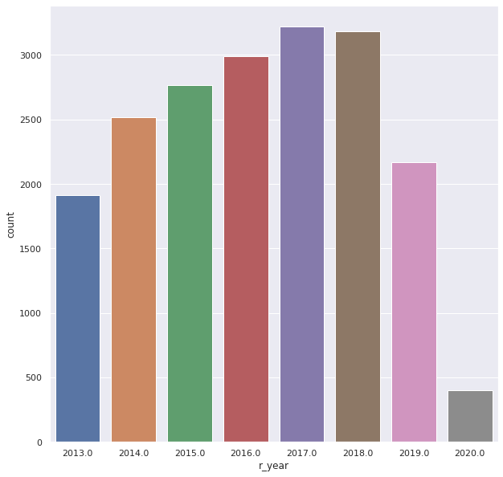
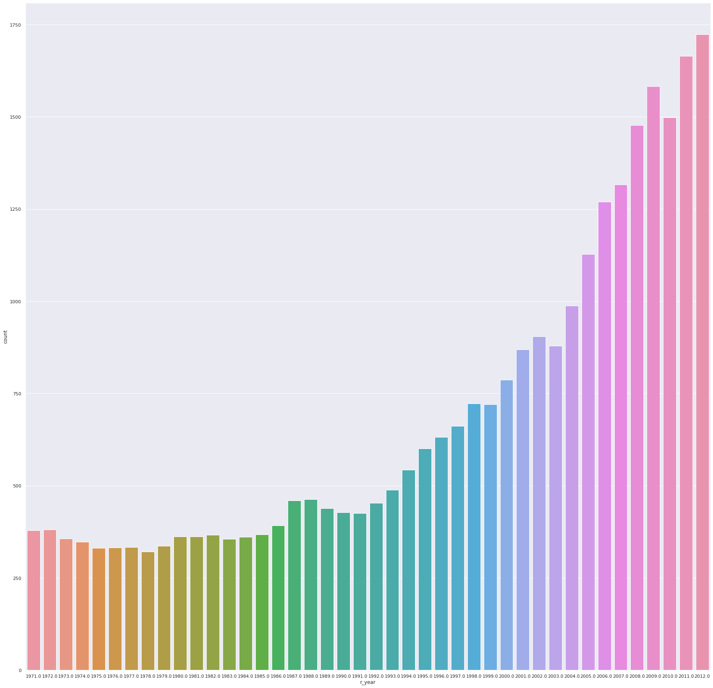

# Movie-Recommendation-System

### Datasets Preparations

Movies Data collected from below sources:-
- [the-movies-dataset](https://www.kaggle.com/rounakbanik/the-movies-dataset)   - conatins 45000 movies , used movies released from 1970 to 2012.(file names: movies_metadata.csv , credits.csv) 
- [imdb-extensive-dataset](https://www.kaggle.com/stefanoleone992/imdb-extensive-dataset)  contains 85k movies , used movies released between 2013-2020 . (file name:IMDb_Movies.csv) 

Total Movies count after preprocessing : 47k (approx.)

The final Output (cleaned and preprocessed dataset), i have uploaded it on kaggle , so you can checck it out here [final-datasets](https://www.kaggle.com/himanshubag/movies-dataset-1970-to-2020)

**Movies count (2013-2020)**

**Movies count (1970-2012)**

